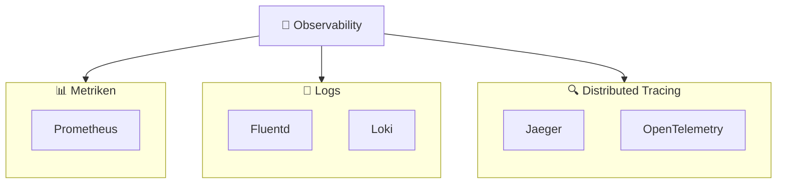
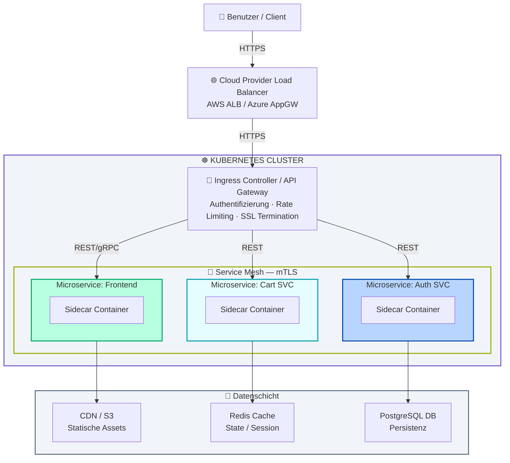

# Was „Cloud Native" wirklich bedeutet: Konzept, Technik und Praxis

Ausgearbeitet im Rahmen der Lehrveranstaltung: 
Virtualisierung & Cloud-Technologien - Hochschule Burgenland 
BITI - 4B2 - SS2026 - **Georg Grünwald**

---

## 1. Worum handelt es sich bei dem Begriff?

„Cloud Native" ist kein physischer Zielort und auch keine spezifische
Technologie, sondern ein ganzheitlicher Ansatz für Softwarearchitektur
und den Anwendungsbetrieb. Es beschreibt die Herangehensweise,
Applikationen von Grund auf so zu konzipieren, zu entwickeln und zu
betreiben, dass sie die inhärenten Vorteile von Cloud-Computing-Modellen
(Elastizität, Skalierbarkeit, Ausfallsicherheit und On-Demand-Ressourcen)
maximal ausschöpfen.

Oft wird Cloud Computing fälschlicherweise mit dem reinen Hosting von
virtuellen Maschinen (VMs) bei Hyperscalern gleichgesetzt („Lift and
Shift"). Cloud Native hingegen bedeutet, dass Systeme explizit für
verteilte, dynamische Umgebungen entworfen werden. Die Cloud Native
Computing Foundation (CNCF) definiert den Begriff durch den Einsatz von
Microservices, Containern, Service Meshes, unveränderlicher Infrastruktur
(Immutable Infrastructure) und deklarativen APIs. Das übergeordnete Ziel
ist es, lose gekoppelte Systeme zu schaffen, die resilient, managebar und
hochgradig beobachtbar (Observable) sind.

---

## 2. In welchem Kontext wird der Begriff verwendet?

Der Begriff dominiert heute die Unternehmens-IT im Kontext der digitalen
Transformation und der Modernisierung von Legacy-Systemen (Application
Modernization). Er fällt immer dann, wenn Unternehmen ihre
Time-to-Market drastisch verkürzen müssen.

In der traditionellen IT (oft monolithisch geprägt) führen
Systemänderungen zu hohem Risiko, langen Release-Zyklen (Waterfall) und
manuellen Wartungsfenstern. Cloud Native wird im Kontext von Agilität,
DevOps-Kultur und Site Reliability Engineering (SRE) angewendet. Es löst
das Problem, dass Software nicht mehr auf langlebigen, individuell
gepflegten Servern („Pets") läuft, sondern auf flüchtigen,
austauschbaren und automatisiert verwalteten Ressourcen („Cattle"). Cloud
Native ist somit die technische Antwort auf die geschäftliche Anforderung
nach kontinuierlicher Innovation (Continuous Delivery) ohne
Stabilitätsverlust.

Pioniere dieses Ansatzes sind Tech-Unternehmen wie Netflix oder Spotify,
die durch eine konsequente Microservices-Architektur tausende Deployments
pro Tag realisieren und so als Blaupause für moderne
Cloud-Native-Strategien dienen.

---

## 3. Technische Funktionsweise und Paradigmen

Technisch basiert Cloud Native auf mehreren Säulen, die eng
ineinandergreifen:

### Containerisierung (OS-Level-Virtualisierung)

Anwendungen werden mitsamt all ihren Abhängigkeiten, Bibliotheken und
Konfigurationen in Container-Images verpackt. Technisch geschieht dies
durch Linux-Kernel-Features wie Namespaces (für Prozess- und
Netzwerk-Isolation) und cgroups (für Ressourcenlimitierung). Container
garantieren, dass eine Applikation auf dem Laptop des Entwicklers exakt
so läuft wie in der Produktionsumgebung.

### Microservices-Architektur

Der funktionale Code wird nicht als ein großer Monolith deployt, sondern
in kleine, unabhängige Dienste zerlegt, die jeweils einen spezifischen
Geschäftszweck erfüllen (Bounded Context). Sie kommunizieren über klar
definierte, leichtgewichtige APIs miteinander. Fällt ein Service aus,
bringt er nicht das Gesamtsystem zum Absturz (Isolierung von
Fehlerdomänen).

### Deklarative APIs und das Controller-Pattern

In Cloud-Native-Systemen wird Infrastruktur nicht mehr durch imperative
Skripte hochgefahren (Schritt-für-Schritt-Befehle). Stattdessen wird ein
Desired State (Soll-Zustand) deklarativ (meist in YAML oder JSON)
beschrieben. Ein Orchestrator vergleicht in einem kontinuierlichen
Reconciliation Loop (Abgleichsschleife) den Ist-Zustand mit dem
Soll-Zustand und passt das System asynchron an.

### Immutable Infrastructure

Einmal bereitgestellte Server oder Container werden niemals nachträglich
gepatcht oder modifiziert. Gibt es ein Update oder eine Fehlerbehebung,
wird das alte Konstrukt vernichtet und durch ein komplett neu gebautes
Image ersetzt.

### 12-Factor-App-Methodik

Als historisches und architektonisches Fundament für
Cloud-Native-Anwendungen dienen oft die Prinzipien der 12-Factor App.
Diese Methodik fordert unter anderem die strikte Trennung von Code und
Konfiguration (z. B. über Umgebungsvariablen) sowie die Entwicklung
zustandsloser Prozesse (Statelessness), um maximale Portabilität und
Skalierbarkeit in verteilten Umgebungen zu gewährleisten.

---

## 4. Gängige Protokolle, Produkte, Tools und Beispiele

Das Cloud-Native-Ökosystem ist enorm vielfältig, lässt sich aber anhand der
CNCF-Landscape in Kernkategorien unterteilen:

| Kategorie                      | Tools & Produkte                             |
|---|---|
| **Container-Runtimes**         | containerd, CRI-O, Docker                    |
| **Orchestrierung & Scheduling**| Kubernetes (K8s), HashiCorp Nomad            |
| **Service Mesh & Netzwerk**    | Istio, Linkerd, Cilium                       |
| **Observability**              | Prometheus, Fluentd / Loki, Jaeger / OpenTelemetry |
| **IaC & GitOps**               | Terraform / OpenTofu, ArgoCD, Flux           |

### Container-Runtimes

Technologien wie **containerd**, **CRI-O** und **Docker** sind
spezialisierte Runtimes, die für das Starten, Stoppen und Verwalten der
Prozesse auf Betriebssystemebene verantwortlich sind. Sie bilden die
absolute Basisumgebung, in der die eigentliche Anwendung läuft. Dabei
kümmern sie sich um das Herunterladen der Container-Images aus einer
Registry, das Entpacken der Dateischichten und die exakte Zuweisung von
Linux-Kernel-Ressourcen wie Namespaces und cgroups. Durch den gemeinsamen
OCI-Standard (Open Container Initiative) sind diese Runtimes flexibel und
transparent austauschbar.

### Serverless & Functions as a Service (FaaS)

Neben der Container-Orchestrierung umfasst Cloud Native zunehmend auch
Serverless-Architekturen. Bei Diensten wie **AWS Lambda**, **Azure
Functions** oder dem Open-Source-Projekt **Knative** abstrahiert der
Cloud-Provider die zugrundeliegende Infrastruktur vollständig. Der Code
wird nur ausgeführt und sekundengenau abgerechnet, wenn ein spezifisches
Ereignis (Event oder HTTP-Request) eintritt.

### Orchestrierung & Scheduling

**Kubernetes (K8s)** hat sich in diesem Bereich als absoluter
De-facto-Standard etabliert, wobei für spezifische Anwendungsfälle auch
Alternativen wie **HashiCorp Nomad** existieren. Ein Orchestrator
verteilt die oft tausenden Container intelligent auf ein Cluster von
physischen oder virtuellen Maschinen (Worker Nodes). Er agiert als
zentrales Kontrollsystem, das kontinuierlich den Soll-Zustand überwacht
und bei Abweichungen sofort eingreift. Dadurch übernimmt Kubernetes
vollautomatisiert kritische Aufgaben wie den Neustart abgestürzter
Anwendungen (Self-Healing), die nahtlose Skalierung bei Lastwechseln und
das interne Load Balancing.

### Service Mesh & Netzwerk

Ein Service Mesh wie **Istio**, **Linkerd** oder **Cilium** legt eine
transparente Infrastrukturschicht über die Microservices, was meist als
„Sidecar-Proxy" neben jedem Container realisiert wird. Es kümmert sich
um Verschlüsselung (Mutual TLS), Traffic-Routing (z. B. für
Canary-Releases) und Zugriffsrichtlinien. Moderne Ansätze wie Cilium
nutzen eBPF (Extended Berkeley Packet Filter) direkt im Linux-Kernel für
performantes Networking.

### Protokolle

- **REST** (über HTTP/1.1 oder HTTP/2) für externe APIs
- **gRPC** (basierend auf Protocol Buffers und HTTP/2) für schnelle,
  interne Microservice-Kommunikation
- **Kafka** (Pub/Sub), **CloudEvents** für ereignisgesteuerte Systeme

### Observability (Die drei Säulen)

In einer stark verteilten Microservices-Architektur reicht klassisches
Monitoring nicht mehr aus. Wenn eine Nutzeranfrage über Dutzende
verschiedene Container wandert, benötigt man vollständige
Systemtransparenz, die sogenannte Observability. Diese Disziplin stützt
sich auf drei zentrale Säulen. **Metriken** (gesammelt von Tools wie
**Prometheus**) liefern aggregierte numerische Daten über den
Systemzustand wie beispielsweise die aktuelle CPU-Auslastung oder
Speichernutzung. **Logs** (verarbeitet durch **Fluentd** oder **Loki**)
protokollieren konkrete Ereignisse und Textmeldungen für die tiefgehende
Fehleranalyse. Die dritte und für Cloud Native entscheidendste Säule ist
das **Distributed Tracing** (implementiert durch **Jaeger** oder
**OpenTelemetry**). Tracing verfolgt den exakten Weg einer einzelnen
Anfrage durch das gesamte Netzwerk und macht Latenzen oder Flaschenhälse
zwischen den isolierten Microservices sofort sichtbar.

### Continuous Integration (CI), IaC & GitOps

Der Cloud-Native-Lebenszyklus beginnt bereits beim Code-Commit. Tools
wie **GitLab CI** oder **GitHub Actions** übernehmen die *Continuous
Integration* (Kompilieren, automatisierte Tests und das Bauen der
Container-Images).

**Terraform** und **OpenTofu** sind anschließend die gängigsten Tools
für das Provisionieren der Cloud-Ressourcen. **ArgoCD** und **Flux**
setzen das GitOps-Paradigma um: Git wird zur „Single Source of Truth"
für die gesamte Infrastruktur und das Deployment.

---

## 5. Architektonische Veranschaulichung

Um die Architektur zu begreifen, hilft die Betrachtung des Datenflusses
von außen nach innen.

### Einfache Erläuterung des Datenflusses

Am Beispiel eines Webshops: Der Request trifft zuerst auf einen externen
Load Balancer und wird in das Kubernetes-Cluster geleitet. Dort nimmt ihn
ein API-Gateway entgegen, prüft grob die Berechtigungen und leitet die
Anfrage an den Frontend-Microservice weiter. Dieser Service läuft als
Container.

Direkt neben ihm läuft unsichtbar ein kleiner Proxy (das Sidecar aus dem
Service Mesh). Wenn das Frontend nun den Warenkorb (Cart-Service) abfragen
muss, redet es nicht direkt mit dem Warenkorb. Das Sidecar fängt die
Anfrage ab, verschlüsselt sie, findet heraus, auf welchem Server der
Cart-Service gerade läuft, und schickt die Anfrage rüber. Jeder Service
ist isoliert und zustandslos (stateless).

Die tatsächlichen Daten (State) liegen ausgelagert in verwalteten
Datenbanken oder Caches ganz unten. Wenn nun am Black Friday tausende
User kommen, merkt Kubernetes das anhand der CPU-Metriken und startet
vollautomatisch einfach 50 weitere Instanzen des Cart-Containers. Das ist
Cloud Native.

---

## 6. Literatur- und Quellenverzeichnis

### Fachliteratur (Bücher)

- Arundel, J., & Domingus, J. (2022). *Cloud Native DevOps with
  Kubernetes: Building, Deploying, and Scaling Modern Applications in
  the Cloud* (2. Aufl.). O'Reilly Media.
  *(Aktuelle Quelle für das Zusammenspiel von Cloud Native, Infrastruktur
  als Code und Observability.)*

- Burns, B., Beda, J., Hightower, K., & Evenson, L. (2022).
  *Kubernetes: Up and Running: Dive into the Future of Infrastructure*
  (3. Aufl.). O'Reilly Media.
  *(Die dritte, überarbeitete Auflage des Standardwerks zur
  Container-Orchestrierung und dem deklarativen Controller-Pattern.)*

- Newman, S. (2021). *Building Microservices: Designing Fine-Grained
  Systems* (2. Aufl.). O'Reilly Media.
  *(Die aktualisierte Auflage des absoluten Klassikers. Erläuterung von
  Bounded Contexts, dezentraler Datenhaltung und zustandsloser
  Service-Architektur.)*

---

### Aktuelle Spezifikationen und Online-Quellen

- Cloud Native Computing Foundation (CNCF) (2024). *CNCF Cloud Native
  Interactive Landscape*. Abgerufen am [03.05.2026], von
  <https://landscape.cncf.io/>
  *(Die fortlaufend aktualisierte Referenz für alle im Text genannten
  Tools wie Containerd, Kubernetes, Istio und Prometheus.)*

- OpenGitOps Working Group (2021). *OpenGitOps Principles v1.0.0*.
  Abgerufen am [03.05.2026], von <https://opengitops.dev/>
  *(Das offizielle Regelwerk der CNCF-Arbeitsgruppe, das den
  deklarativen Ansatz und die kontinuierliche Synchronisierung
  („Reconciliation Loop") formalisiert.)*

- Cloud Native Computing Foundation (CNCF) (2023). *Cloud Native
  Security Whitepaper (v2)*. Abgerufen am [03.05.2026], von
  <https://github.com/cncf/tag-security>
  *(Hochaktuelle Referenz für die Notwendigkeit von Service Meshes und
  mTLS-Verschlüsselung innerhalb von Microservice-Architekturen.)*

- Amazon Web Services (2023). *Einführung in Serverless Computing*.
  Abgerufen am [03.05.2026], von
  <https://aws.amazon.com/de/serverless/>
  *(Referenz für die Abstraktion der Infrastrukturschicht und das
  Event-gesteuerte Ausführungsmodell von Functions as a Service.)*

- eBPF Foundation (2024). *What is eBPF?*. Abgerufen am [03.05.2026],
  von <https://ebpf.io/what-is-ebpf/>
  *(Technische Grundlage für die Erläuterung des performanten
  Netzwerk-Routings direkt im Linux-Kernel ohne zusätzliche
  Sidecar-Overheads.)*
